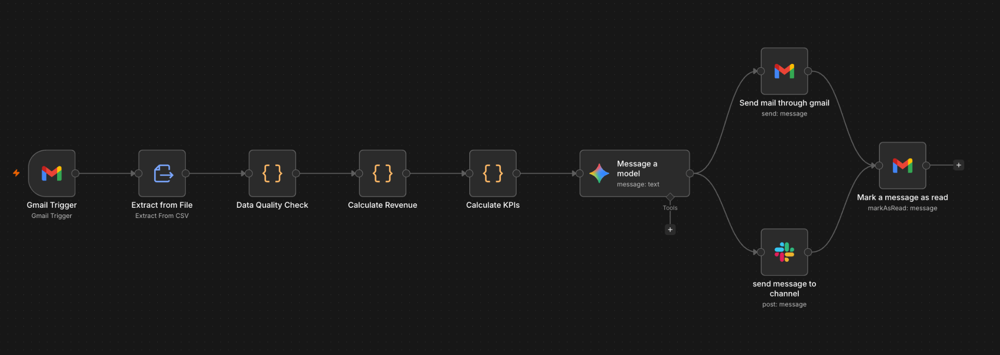
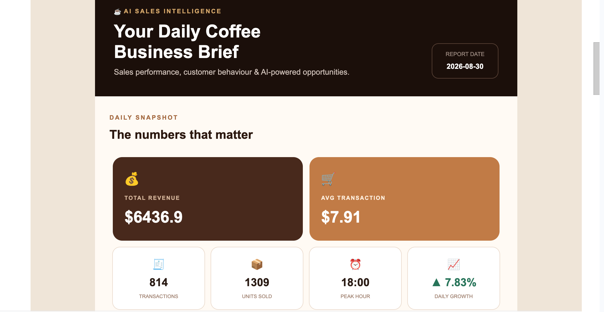
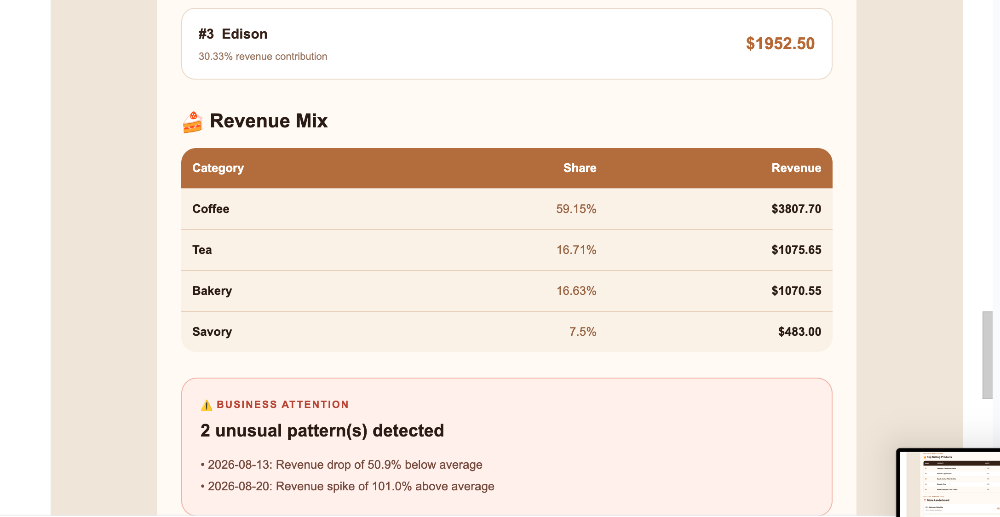
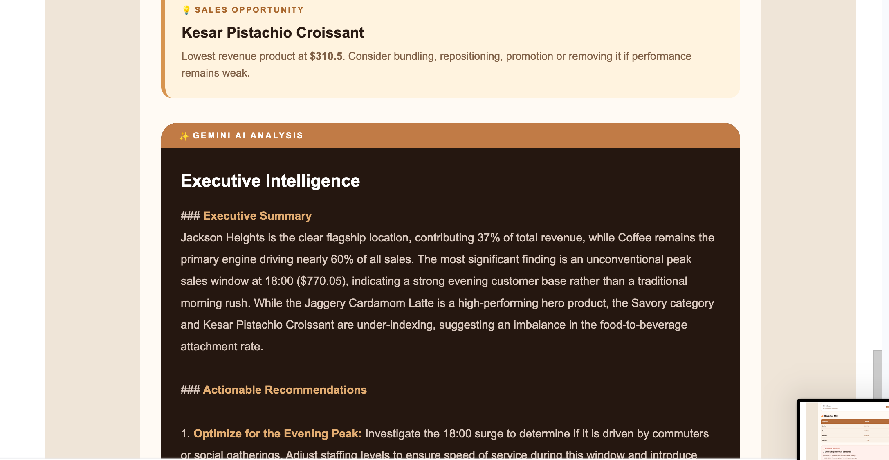
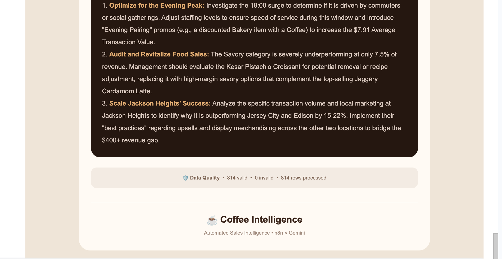

# Coffee Shop Sales Automation
An n8n workflow that turns an emailed sales CSV into revenue metrics and an AI-generated business summary, delivered through Gmail and Slack.



## Sample Output
Selected screenshots from a generated Gmail report supplied by the project author. These illustrate a different input dataset from the three-row example below.

### Sales snapshot
The report shows **$6,436.90 revenue**, **814 transactions**, **1,309 units sold** and **$7.91 average transaction value**.



### Revenue mix and unusual patterns
Category revenue contributions and flagged daily revenue spikes or drops.



### Gemini summary and recommendations
The generated narrative discusses Jackson Heights, the evening sales peak and product performance. Recommendations are AI-generated suggestions for review.





## What it does
1. Polls Gmail every minute for unread messages and downloads attachments.
2. Extracts the first attachment as a pipe-delimited CSV.
3. Flags missing fields, duplicate transaction IDs, and non-positive quantities or prices.
4. Calculates row revenue as quantity × unit price.
5. Aggregates valid rows into revenue, transaction counts, quantity sold, average transaction value, store and category rankings, product performance, and hourly/daily revenue.
6. Sends selected metrics to Gemini for a summary and recommendations.
7. Delivers an HTML email and a Slack message, then marks the source email as read.

## Files
- `workflows/coffee_shop.json`: importable workflow with personal configuration removed.
- `assets/workflow.png`: workflow screenshot.
- `assets/output/`: selected screenshots of the generated Gmail report.
- This README: output previews, input example, setup and implementation notes.

## Setup
1. Download `workflows/coffee_shop.json` and import it into n8n.
2. Reconnect Gmail credentials in the trigger, send-email and mark-as-read nodes.
3. Configure Gemini access in **Message a model** and choose a model available to your account. The original export references `models/gemini-3-flash-preview`; availability may differ.
4. Connect Slack credentials and replace `YOUR_SLACK_CHANNEL_ID` with your destination channel. Ensure the Slack app can post there.
5. Replace `your-email@example.com` in the Gmail send node.
6. Restrict the Gmail trigger to your sales-report emails before enabling it. The exported filter currently matches all unread messages.
7. Send a test email with the sales CSV as its first attachment and run a manual test.
8. Check extraction, KPI output and both delivery destinations. Then enable/publish the workflow in your n8n instance.

GitHub stores the project. n8n runs the automation and must remain available for email polling.

## Example input
Save the following synthetic example as `sample-sales.csv`. The extractor currently uses **pipe (`|`) as the delimiter**, even though the extension is CSV. For comma-separated input, change the delimiter in **Extract from File**.

```text
transaction_id|transaction_date|transaction_time|transaction_qty|unit_price|store_location|product_category|product_detail
1|2026-09-01|08:15:00|2|3.50|Downtown|Coffee|Latte
2|2026-09-01|09:00:00|1|2.50|Riverside|Tea|Green Tea
3|2026-09-02|10:30:00|3|4.00|Downtown|Coffee|Mocha
```

Expected totals for this example: **revenue 21.50, 3 transactions, 6 units, average transaction value 7.17**. Reports currently display dollar symbols; adjust the templates if your source uses another currency.

## Implementation notes
- Calculations use JavaScript Code nodes. Gemini writes the narrative from selected aggregated metrics.
- Invalid rows are excluded from KPIs. Duplicate transaction IDs are treated as invalid, so this assumes one row per transaction.
- Daily growth uses sorted date strings. Use `YYYY-MM-DD` dates so chronological ordering is correct.
- “Busiest hour” means the hour with the highest revenue, rather than the highest transaction count.
- Email and Slack each connect to the mark-as-read node. This is not a join that confirms both deliveries succeeded; add a Merge step if that guarantee is needed.
- The first attachment is expected to be the sales file. There is no file-type guard or persistent cross-run deduplication.
- The workflow is saved inactive. Recipients and account references are placeholders that require configuration.

## Validation
The workflow JSON was parsed and its structure checked for publication. The end-to-end Gmail, Gemini and Slack execution has not been tested as part of this repository upload.
